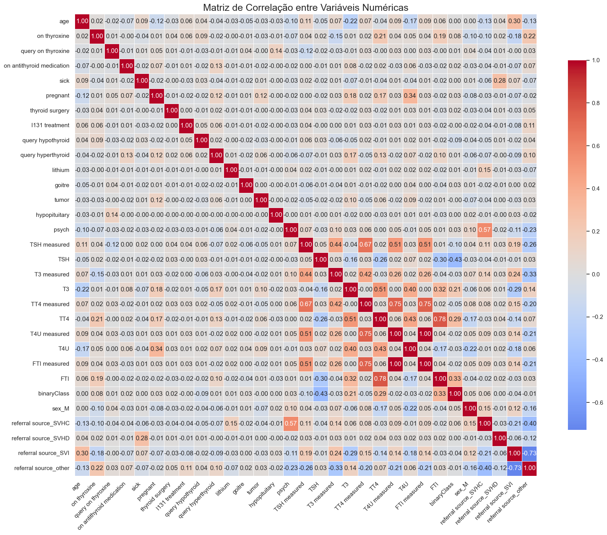
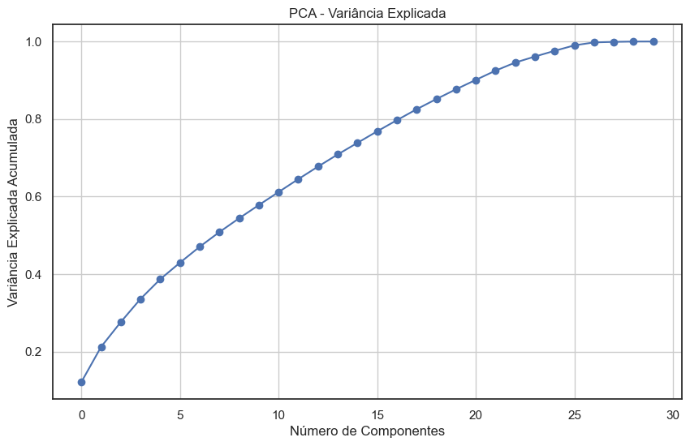
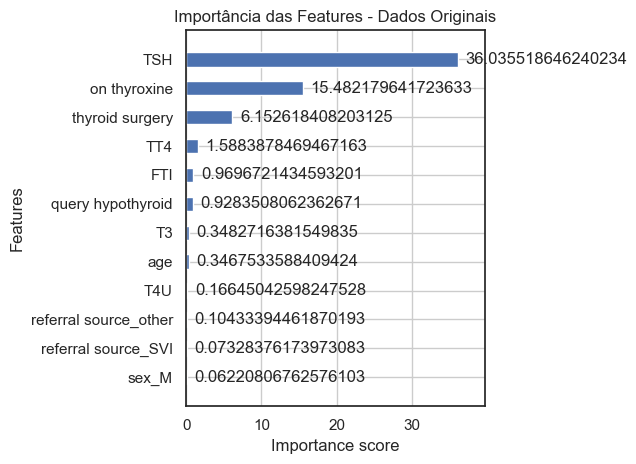

# Projeto Final EBAC - Cientista de Dados - Hypothyroid


```python
import pandas as pd
import numpy as np
import matplotlib.pyplot as plt
import seaborn as sns

from sklearn.preprocessing import LabelEncoder
from sklearn.preprocessing import StandardScaler
from sklearn.decomposition import PCA
from sklearn.model_selection import train_test_split, cross_val_score
from sklearn.metrics import classification_report, confusion_matrix, ConfusionMatrixDisplay

from xgboost import XGBClassifier, plot_importance
```

## Carregar Dados


```python
df = pd.read_csv('Base_M43_Pratique_Hypothyroid.csv')  # Altere para o nome real
df.head()
```

<table border="1" class="dataframe">
  <thead>
    <tr style="text-align: right;">
      <th></th>
      <th>age</th>
      <th>sex</th>
      <th>on thyroxine</th>
      <th>query on thyroxine</th>
      <th>on antithyroid medication</th>
      <th>sick</th>
      <th>pregnant</th>
      <th>thyroid surgery</th>
      <th>I131 treatment</th>
      <th>query hypothyroid</th>
      <th>...</th>
      <th>TT4 measured</th>
      <th>TT4</th>
      <th>T4U measured</th>
      <th>T4U</th>
      <th>FTI measured</th>
      <th>FTI</th>
      <th>TBG measured</th>
      <th>TBG</th>
      <th>referral source</th>
      <th>binaryClass</th>
    </tr>
  </thead>
  <tbody>
    <tr>
      <th>0</th>
      <td>41</td>
      <td>F</td>
      <td>f</td>
      <td>f</td>
      <td>f</td>
      <td>f</td>
      <td>f</td>
      <td>f</td>
      <td>f</td>
      <td>f</td>
      <td>...</td>
      <td>t</td>
      <td>125</td>
      <td>t</td>
      <td>1.14</td>
      <td>t</td>
      <td>109</td>
      <td>f</td>
      <td>?</td>
      <td>SVHC</td>
      <td>P</td>
    </tr>
    <tr>
      <th>1</th>
      <td>23</td>
      <td>F</td>
      <td>f</td>
      <td>f</td>
      <td>f</td>
      <td>f</td>
      <td>f</td>
      <td>f</td>
      <td>f</td>
      <td>f</td>
      <td>...</td>
      <td>t</td>
      <td>102</td>
      <td>f</td>
      <td>?</td>
      <td>f</td>
      <td>?</td>
      <td>f</td>
      <td>?</td>
      <td>other</td>
      <td>P</td>
    </tr>
    <tr>
      <th>2</th>
      <td>46</td>
      <td>M</td>
      <td>f</td>
      <td>f</td>
      <td>f</td>
      <td>f</td>
      <td>f</td>
      <td>f</td>
      <td>f</td>
      <td>f</td>
      <td>...</td>
      <td>t</td>
      <td>109</td>
      <td>t</td>
      <td>0.91</td>
      <td>t</td>
      <td>120</td>
      <td>f</td>
      <td>?</td>
      <td>other</td>
      <td>P</td>
    </tr>
    <tr>
      <th>3</th>
      <td>70</td>
      <td>F</td>
      <td>t</td>
      <td>f</td>
      <td>f</td>
      <td>f</td>
      <td>f</td>
      <td>f</td>
      <td>f</td>
      <td>f</td>
      <td>...</td>
      <td>t</td>
      <td>175</td>
      <td>f</td>
      <td>?</td>
      <td>f</td>
      <td>?</td>
      <td>f</td>
      <td>?</td>
      <td>other</td>
      <td>P</td>
    </tr>
    <tr>
      <th>4</th>
      <td>70</td>
      <td>F</td>
      <td>f</td>
      <td>f</td>
      <td>f</td>
      <td>f</td>
      <td>f</td>
      <td>f</td>
      <td>f</td>
      <td>f</td>
      <td>...</td>
      <td>t</td>
      <td>61</td>
      <td>t</td>
      <td>0.87</td>
      <td>t</td>
      <td>70</td>
      <td>f</td>
      <td>?</td>
      <td>SVI</td>
      <td>P</td>
    </tr>
  </tbody>
</table>
<p>5 rows × 30 columns</p>
</div>


```python
df.info()
```

    <class 'pandas.core.frame.DataFrame'>
    RangeIndex: 3772 entries, 0 to 3771
    Data columns (total 30 columns):
     #   Column                     Non-Null Count  Dtype 
    ---  ------                     --------------  ----- 
     0   age                        3772 non-null   object
     1   sex                        3772 non-null   object
     2   on thyroxine               3772 non-null   object
     3   query on thyroxine         3772 non-null   object
     4   on antithyroid medication  3772 non-null   object
     5   sick                       3772 non-null   object
     6   pregnant                   3772 non-null   object
     7   thyroid surgery            3772 non-null   object
     8   I131 treatment             3772 non-null   object
     9   query hypothyroid          3772 non-null   object
     10  query hyperthyroid         3772 non-null   object
     11  lithium                    3772 non-null   object
     12  goitre                     3772 non-null   object
     13  tumor                      3772 non-null   object
     14  hypopituitary              3772 non-null   object
     15  psych                      3772 non-null   object
     16  TSH measured               3772 non-null   object
     17  TSH                        3772 non-null   object
     18  T3 measured                3772 non-null   object
     19  T3                         3772 non-null   object
     20  TT4 measured               3772 non-null   object
     21  TT4                        3772 non-null   object
     22  T4U measured               3772 non-null   object
     23  T4U                        3772 non-null   object
     24  FTI measured               3772 non-null   object
     25  FTI                        3772 non-null   object
     26  TBG measured               3772 non-null   object
     27  TBG                        3772 non-null   object
     28  referral source            3772 non-null   object
     29  binaryClass                3772 non-null   object
    dtypes: object(30)
    memory usage: 884.2+ KB
    


```python
df.describe()
```


<div>
<table border="1" class="dataframe">
  <thead>
    <tr style="text-align: right;">
      <th></th>
      <th>age</th>
      <th>sex</th>
      <th>on thyroxine</th>
      <th>query on thyroxine</th>
      <th>on antithyroid medication</th>
      <th>sick</th>
      <th>pregnant</th>
      <th>thyroid surgery</th>
      <th>I131 treatment</th>
      <th>query hypothyroid</th>
      <th>...</th>
      <th>TT4 measured</th>
      <th>TT4</th>
      <th>T4U measured</th>
      <th>T4U</th>
      <th>FTI measured</th>
      <th>FTI</th>
      <th>TBG measured</th>
      <th>TBG</th>
      <th>referral source</th>
      <th>binaryClass</th>
    </tr>
  </thead>
  <tbody>
    <tr>
      <th>count</th>
      <td>3772</td>
      <td>3772</td>
      <td>3772</td>
      <td>3772</td>
      <td>3772</td>
      <td>3772</td>
      <td>3772</td>
      <td>3772</td>
      <td>3772</td>
      <td>3772</td>
      <td>...</td>
      <td>3772</td>
      <td>3772</td>
      <td>3772</td>
      <td>3772</td>
      <td>3772</td>
      <td>3772</td>
      <td>3772</td>
      <td>3772</td>
      <td>3772</td>
      <td>3772</td>
    </tr>
    <tr>
      <th>unique</th>
      <td>94</td>
      <td>3</td>
      <td>2</td>
      <td>2</td>
      <td>2</td>
      <td>2</td>
      <td>2</td>
      <td>2</td>
      <td>2</td>
      <td>2</td>
      <td>...</td>
      <td>2</td>
      <td>242</td>
      <td>2</td>
      <td>147</td>
      <td>2</td>
      <td>235</td>
      <td>1</td>
      <td>1</td>
      <td>5</td>
      <td>2</td>
    </tr>
    <tr>
      <th>top</th>
      <td>59</td>
      <td>F</td>
      <td>f</td>
      <td>f</td>
      <td>f</td>
      <td>f</td>
      <td>f</td>
      <td>f</td>
      <td>f</td>
      <td>f</td>
      <td>...</td>
      <td>t</td>
      <td>?</td>
      <td>t</td>
      <td>?</td>
      <td>t</td>
      <td>?</td>
      <td>f</td>
      <td>?</td>
      <td>other</td>
      <td>P</td>
    </tr>
    <tr>
      <th>freq</th>
      <td>95</td>
      <td>2480</td>
      <td>3308</td>
      <td>3722</td>
      <td>3729</td>
      <td>3625</td>
      <td>3719</td>
      <td>3719</td>
      <td>3713</td>
      <td>3538</td>
      <td>...</td>
      <td>3541</td>
      <td>231</td>
      <td>3385</td>
      <td>387</td>
      <td>3387</td>
      <td>385</td>
      <td>3772</td>
      <td>3772</td>
      <td>2201</td>
      <td>3481</td>
    </tr>
  </tbody>
</table>
<p>4 rows × 30 columns</p>
</div>


A análise inicial dos dados revelou algumas questões importantes que precisam ser tratadas. Primeiramente, a maioria das colunas, incluindo variáveis que deveriam ser numéricas como idade e níveis hormonais (TSH, T3, TT4, T4U, FTI, TBG), foram erroneamente classificadas como object. Essa categorização incorreta é um forte indício da presença de valores ausentes ou caracteres não numéricos, como o ponto de interrogação ("?"), que precisam ser devidamente tratados para permitir a conversão para tipos de dados numéricos. Além disso, observou-se que diversas colunas de medição hormonal possuem uma coluna auxiliar (_measured) que indica se o exame foi realizado. Essa dualidade pode ser valiosa para decidir estratégias de imputação de valores ausentes e, potencialmente, servir como uma feature adicional para o treinamento do modelo, indicando se a medição foi ou não efetuada.

Outro ponto crítico identificado é o desequilíbrio na coluna binaryClass, que possui os valores "P" e "N". O valor "P" é predominantemente frequente, representando aproximadamente 92% dos registros (3481 de 3772). Essa disparidade significativa entre as classes pode impactar negativamente o desempenho do modelo preditivo, exigindo a aplicação de técnicas de balanceamento para garantir que o modelo não seja viesado em favor da classe majoritária.

## Pré-processamento


```python
# Conversão de "?" para NaN
df.replace("?", np.nan, inplace=True)
```
    

```python
# Conversão de Tipos Numéricos
numerical_cols = ['age', 'TSH', 'T3', 'TT4', 'T4U', 'FTI', 'TBG']
df[numerical_cols] = df[numerical_cols].apply(pd.to_numeric, errors='coerce')
```


```python
# Tratar Valores Faltantes
for col in numerical_cols:
    df[col] = df.groupby('binaryClass')[col].transform(lambda x: x.fillna(x.median()))
```


```python
# Codificação de Variáveis Categóricas
le = LabelEncoder()
df['binaryClass'] = le.fit_transform(df['binaryClass'])  # P = 1, N = 0

# One-hot para categóricas com múltiplos valores
categorical_cols = ['sex', 'referral source']
df = pd.get_dummies(df, columns=categorical_cols, drop_first=True)

# Codificar booleanos (f/t) para 0/1
bool_cols = df.columns[df.isin(['f', 't']).any()]
df[bool_cols] = df[bool_cols].replace({'f': 0, 't': 1})
```    


```python
df.info()
```

    <class 'pandas.core.frame.DataFrame'>
    RangeIndex: 3772 entries, 0 to 3771
    Data columns (total 33 columns):
     #   Column                     Non-Null Count  Dtype  
    ---  ------                     --------------  -----  
     0   age                        3772 non-null   float64
     1   on thyroxine               3772 non-null   int64  
     2   query on thyroxine         3772 non-null   int64  
     3   on antithyroid medication  3772 non-null   int64  
     4   sick                       3772 non-null   int64  
     5   pregnant                   3772 non-null   int64  
     6   thyroid surgery            3772 non-null   int64  
     7   I131 treatment             3772 non-null   int64  
     8   query hypothyroid          3772 non-null   int64  
     9   query hyperthyroid         3772 non-null   int64  
     10  lithium                    3772 non-null   int64  
     11  goitre                     3772 non-null   int64  
     12  tumor                      3772 non-null   int64  
     13  hypopituitary              3772 non-null   int64  
     14  psych                      3772 non-null   int64  
     15  TSH measured               3772 non-null   int64  
     16  TSH                        3772 non-null   float64
     17  T3 measured                3772 non-null   int64  
     18  T3                         3772 non-null   float64
     19  TT4 measured               3772 non-null   int64  
     20  TT4                        3772 non-null   float64
     21  T4U measured               3772 non-null   int64  
     22  T4U                        3772 non-null   float64
     23  FTI measured               3772 non-null   int64  
     24  FTI                        3772 non-null   float64
     25  TBG measured               3772 non-null   int64  
     26  TBG                        0 non-null      float64
     27  binaryClass                3772 non-null   int32  
     28  sex_M                      3772 non-null   bool   
     29  referral source_SVHC       3772 non-null   bool   
     30  referral source_SVHD       3772 non-null   bool   
     31  referral source_SVI        3772 non-null   bool   
     32  referral source_other      3772 non-null   bool   
    dtypes: bool(5), float64(7), int32(1), int64(20)
    memory usage: 828.9 KB
    


```python
df.describe()
```


<div>
<table border="1" class="dataframe">
  <thead>
    <tr style="text-align: right;">
      <th></th>
      <th>age</th>
      <th>on thyroxine</th>
      <th>query on thyroxine</th>
      <th>on antithyroid medication</th>
      <th>sick</th>
      <th>pregnant</th>
      <th>thyroid surgery</th>
      <th>I131 treatment</th>
      <th>query hypothyroid</th>
      <th>query hyperthyroid</th>
      <th>...</th>
      <th>T3</th>
      <th>TT4 measured</th>
      <th>TT4</th>
      <th>T4U measured</th>
      <th>T4U</th>
      <th>FTI measured</th>
      <th>FTI</th>
      <th>TBG measured</th>
      <th>TBG</th>
      <th>binaryClass</th>
    </tr>
  </thead>
  <tbody>
    <tr>
      <th>count</th>
      <td>3772.000000</td>
      <td>3772.000000</td>
      <td>3772.000000</td>
      <td>3772.000000</td>
      <td>3772.000000</td>
      <td>3772.000000</td>
      <td>3772.000000</td>
      <td>3772.000000</td>
      <td>3772.000000</td>
      <td>3772.000000</td>
      <td>...</td>
      <td>3772.000000</td>
      <td>3772.000000</td>
      <td>3772.000000</td>
      <td>3772.000000</td>
      <td>3772.000000</td>
      <td>3772.000000</td>
      <td>3772.000000</td>
      <td>3772.0</td>
      <td>0.0</td>
      <td>3772.000000</td>
    </tr>
    <tr>
      <th>mean</th>
      <td>51.736479</td>
      <td>0.123012</td>
      <td>0.013256</td>
      <td>0.011400</td>
      <td>0.038971</td>
      <td>0.014051</td>
      <td>0.014051</td>
      <td>0.015642</td>
      <td>0.062036</td>
      <td>0.062831</td>
      <td>...</td>
      <td>2.004650</td>
      <td>0.938759</td>
      <td>108.078287</td>
      <td>0.897402</td>
      <td>0.992700</td>
      <td>0.897932</td>
      <td>110.015429</td>
      <td>0.0</td>
      <td>NaN</td>
      <td>0.922853</td>
    </tr>
    <tr>
      <th>std</th>
      <td>20.082329</td>
      <td>0.328494</td>
      <td>0.114382</td>
      <td>0.106174</td>
      <td>0.193552</td>
      <td>0.117716</td>
      <td>0.117716</td>
      <td>0.124101</td>
      <td>0.241253</td>
      <td>0.242692</td>
      <td>...</td>
      <td>0.740408</td>
      <td>0.239803</td>
      <td>34.524686</td>
      <td>0.303473</td>
      <td>0.185308</td>
      <td>0.302778</td>
      <td>31.475763</td>
      <td>0.0</td>
      <td>NaN</td>
      <td>0.266861</td>
    </tr>
    <tr>
      <th>min</th>
      <td>1.000000</td>
      <td>0.000000</td>
      <td>0.000000</td>
      <td>0.000000</td>
      <td>0.000000</td>
      <td>0.000000</td>
      <td>0.000000</td>
      <td>0.000000</td>
      <td>0.000000</td>
      <td>0.000000</td>
      <td>...</td>
      <td>0.050000</td>
      <td>0.000000</td>
      <td>2.000000</td>
      <td>0.000000</td>
      <td>0.250000</td>
      <td>0.000000</td>
      <td>2.000000</td>
      <td>0.0</td>
      <td>NaN</td>
      <td>0.000000</td>
    </tr>
    <tr>
      <th>25%</th>
      <td>36.000000</td>
      <td>0.000000</td>
      <td>0.000000</td>
      <td>0.000000</td>
      <td>0.000000</td>
      <td>0.000000</td>
      <td>0.000000</td>
      <td>0.000000</td>
      <td>0.000000</td>
      <td>0.000000</td>
      <td>...</td>
      <td>1.700000</td>
      <td>1.000000</td>
      <td>89.000000</td>
      <td>1.000000</td>
      <td>0.890000</td>
      <td>1.000000</td>
      <td>94.000000</td>
      <td>0.0</td>
      <td>NaN</td>
      <td>1.000000</td>
    </tr>
    <tr>
      <th>50%</th>
      <td>54.000000</td>
      <td>0.000000</td>
      <td>0.000000</td>
      <td>0.000000</td>
      <td>0.000000</td>
      <td>0.000000</td>
      <td>0.000000</td>
      <td>0.000000</td>
      <td>0.000000</td>
      <td>0.000000</td>
      <td>...</td>
      <td>2.000000</td>
      <td>1.000000</td>
      <td>105.000000</td>
      <td>1.000000</td>
      <td>0.970000</td>
      <td>1.000000</td>
      <td>108.000000</td>
      <td>0.0</td>
      <td>NaN</td>
      <td>1.000000</td>
    </tr>
    <tr>
      <th>75%</th>
      <td>67.000000</td>
      <td>0.000000</td>
      <td>0.000000</td>
      <td>0.000000</td>
      <td>0.000000</td>
      <td>0.000000</td>
      <td>0.000000</td>
      <td>0.000000</td>
      <td>0.000000</td>
      <td>0.000000</td>
      <td>...</td>
      <td>2.200000</td>
      <td>1.000000</td>
      <td>123.000000</td>
      <td>1.000000</td>
      <td>1.070000</td>
      <td>1.000000</td>
      <td>121.250000</td>
      <td>0.0</td>
      <td>NaN</td>
      <td>1.000000</td>
    </tr>
    <tr>
      <th>max</th>
      <td>455.000000</td>
      <td>1.000000</td>
      <td>1.000000</td>
      <td>1.000000</td>
      <td>1.000000</td>
      <td>1.000000</td>
      <td>1.000000</td>
      <td>1.000000</td>
      <td>1.000000</td>
      <td>1.000000</td>
      <td>...</td>
      <td>10.600000</td>
      <td>1.000000</td>
      <td>430.000000</td>
      <td>1.000000</td>
      <td>2.320000</td>
      <td>1.000000</td>
      <td>395.000000</td>
      <td>0.0</td>
      <td>NaN</td>
      <td>1.000000</td>
    </tr>
  </tbody>
</table>
<p>8 rows × 28 columns</p>
</div>


```python
# Remover coluna sem informação
df.drop(columns=['TBG'], inplace=True)
df.drop(columns=['TBG measured'], inplace=True)
```


```python
# Corrigir outliers em 'age'
df = df[df['age'] <= 100]
```

## Matriz de Correlação


```python
# Calcula a matriz de correlação
correlation_matrix = df.corr(numeric_only=True)

# Define tamanho da figura e estilo
plt.figure(figsize=(18, 14))
sns.set(style="white")

# Plot da matriz com mapa de calor
sns.heatmap(correlation_matrix, annot=True, fmt=".2f", cmap="coolwarm", center=0,
            square=True, linewidths=.5, cbar_kws={"shrink": .8})

plt.title("Matriz de Correlação entre Variáveis Numéricas", fontsize=18)
plt.xticks(rotation=45, ha='right')
plt.tight_layout()
plt.show()
```


    

    


A matriz de correlação revela que a variável binaryClass (indicadora de disfunção na tireoide) possui correlações moderadas com TSH (0.43), FTI (-0.37), T3 (-0.33) e TT4 (-0.30), indicando que esses hormônios são relevantes para o diagnóstico e devem ser priorizados na modelagem. Algumas variáveis como psych (-0.23) e referral source_SVHD (-0.26) também apresentam associação com a variável alvo, sugerindo possíveis relações clínicas ou padrões de encaminhamento. As variáveis do tipo “measured”, como TSH measured e T3 measured, têm alta correlação com os próprios valores medidos e podem ser redundantes.

Além disso, nota-se colinearidade entre variáveis hormonais — TT4, T4U e FTI estão fortemente correlacionadas entre si (r > 0.75), o que pode causar problemas de multicolinearidade nos modelos. Recomenda-se considerar a remoção ou combinação dessas variáveis, ou ainda aplicar redução de dimensionalidade com PCA. Por fim, a origem do encaminhamento (referral source) mostra forte correlação negativa entre si por ser codificada com one-hot encoding, o que é esperado. A análise indica que variáveis hormonais são centrais para prever a disfunção, e o cuidado com redundâncias será essencial para evitar sobreajuste.

# PCA para visualização e variância explicada


```python
# Normalização dos Dados para PCA
X = df.drop('binaryClass', axis=1)
y = df['binaryClass']

scaler = StandardScaler()
X_scaled = scaler.fit_transform(X)
```


```python
pca = PCA()
pca_result = pca.fit_transform(X_scaled)

# Scree plot
plt.figure(figsize=(10, 6))
plt.plot(np.cumsum(pca.explained_variance_ratio_), marker='o')
plt.xlabel('Número de Componentes')
plt.ylabel('Variância Explicada Acumulada')
plt.title('PCA - Variância Explicada')
plt.grid(True)
plt.show()
```


    

    


O gráfico de variância explicada acumulada pelo PCA mostra que cerca de 20 componentes principais são suficientes para capturar aproximadamente 90% da variância dos dados. Isso indica que é possível reduzir significativamente a dimensionalidade do dataset sem grande perda de informação, o que ajuda a acelerar o treinamento, diminuir overfitting e melhorar a interpretabilidade. Essa redução é especialmente útil considerando a presença de colinearidade entre variáveis, como visto na matriz de correlação.

# Treinamento do modelo - XBOOST


```python
X_train, X_test, y_train, y_test = train_test_split(X, y, stratify=y, test_size=0.2, random_state=42)
```


```python
# Modelo com dados ORIGINAIS para interpretar importância das features
xgb_original = XGBClassifier(random_state=42, use_label_encoder=False, eval_metric='logloss')
xgb_original.fit(X_train, y_train)
```
    


<div id="sk-container-id-1" class="sk-top-container"><div class="sk-text-repr-fallback"><pre>XGBClassifier(base_score=None, booster=None, callbacks=None,
              colsample_bylevel=None, colsample_bynode=None,
              colsample_bytree=None, device=None, early_stopping_rounds=None,
              enable_categorical=False, eval_metric=&#x27;logloss&#x27;,
              feature_types=None, feature_weights=None, gamma=None,
              grow_policy=None, importance_type=None,
              interaction_constraints=None, learning_rate=None, max_bin=None,
              max_cat_threshold=None, max_cat_to_onehot=None,
              max_delta_step=None, max_depth=None, max_leaves=None,
              min_child_weight=None, missing=nan, monotone_constraints=None,
              multi_strategy=None, n_estimators=None, n_jobs=None,
              num_parallel_tree=None, ...)</pre><b>In a Jupyter environment, please rerun this cell to show the HTML representation or trust the notebook. <br />On GitHub, the HTML representation is unable to render, please try loading this page with nbviewer.org.</b></div><div class="sk-container" hidden><div class="sk-item"><div class="sk-estimator fitted sk-toggleable"><input class="sk-toggleable__control sk-hidden--visually" id="sk-estimator-id-1" type="checkbox" checked><label for="sk-estimator-id-1" class="sk-toggleable__label fitted sk-toggleable__label-arrow fitted">&nbsp;&nbsp;XGBClassifier<a class="sk-estimator-doc-link fitted" rel="noreferrer" target="_blank" href="https://xgboost.readthedocs.io/en/release_3.0.0/python/python_api.html#xgboost.XGBClassifier">?<span>Documentation for XGBClassifier</span></a><span class="sk-estimator-doc-link fitted">i<span>Fitted</span></span></label><div class="sk-toggleable__content fitted"><pre>XGBClassifier(base_score=None, booster=None, callbacks=None,
              colsample_bylevel=None, colsample_bynode=None,
              colsample_bytree=None, device=None, early_stopping_rounds=None,
              enable_categorical=False, eval_metric=&#x27;logloss&#x27;,
              feature_types=None, feature_weights=None, gamma=None,
              grow_policy=None, importance_type=None,
              interaction_constraints=None, learning_rate=None, max_bin=None,
              max_cat_threshold=None, max_cat_to_onehot=None,
              max_delta_step=None, max_depth=None, max_leaves=None,
              min_child_weight=None, missing=nan, monotone_constraints=None,
              multi_strategy=None, n_estimators=None, n_jobs=None,
              num_parallel_tree=None, ...)</pre></div> </div></div></div></div>


```python
# Importância das features
plt.figure(figsize=(12, 6))
plot_importance(xgb_original, max_num_features=20, importance_type='gain', height=0.5)
plt.title('Importância das Features - Dados Originais')
plt.tight_layout()
plt.show()
```


    

    


```python
# Redução de dimensionalidade com PCA
pca = PCA(n_components=20, random_state=42)
X_train_pca = pca.fit_transform(X_train)
X_test_pca = pca.transform(X_test)
```


```python
# Modelo com dados PCA
xgb_pca = XGBClassifier(random_state=42, use_label_encoder=False, eval_metric='logloss')
xgb_pca.fit(X_train_pca, y_train)
```
    

<div id="sk-container-id-2" class="sk-top-container"><div class="sk-text-repr-fallback"><pre>XGBClassifier(base_score=None, booster=None, callbacks=None,
              colsample_bylevel=None, colsample_bynode=None,
              colsample_bytree=None, device=None, early_stopping_rounds=None,
              enable_categorical=False, eval_metric=&#x27;logloss&#x27;,
              feature_types=None, feature_weights=None, gamma=None,
              grow_policy=None, importance_type=None,
              interaction_constraints=None, learning_rate=None, max_bin=None,
              max_cat_threshold=None, max_cat_to_onehot=None,
              max_delta_step=None, max_depth=None, max_leaves=None,
              min_child_weight=None, missing=nan, monotone_constraints=None,
              multi_strategy=None, n_estimators=None, n_jobs=None,
              num_parallel_tree=None, ...)</pre><b>In a Jupyter environment, please rerun this cell to show the HTML representation or trust the notebook. <br />On GitHub, the HTML representation is unable to render, please try loading this page with nbviewer.org.</b></div><div class="sk-container" hidden><div class="sk-item"><div class="sk-estimator fitted sk-toggleable"><input class="sk-toggleable__control sk-hidden--visually" id="sk-estimator-id-2" type="checkbox" checked><label for="sk-estimator-id-2" class="sk-toggleable__label fitted sk-toggleable__label-arrow fitted">&nbsp;&nbsp;XGBClassifier<a class="sk-estimator-doc-link fitted" rel="noreferrer" target="_blank" href="https://xgboost.readthedocs.io/en/release_3.0.0/python/python_api.html#xgboost.XGBClassifier">?<span>Documentation for XGBClassifier</span></a><span class="sk-estimator-doc-link fitted">i<span>Fitted</span></span></label><div class="sk-toggleable__content fitted"><pre>XGBClassifier(base_score=None, booster=None, callbacks=None,
              colsample_bylevel=None, colsample_bynode=None,
              colsample_bytree=None, device=None, early_stopping_rounds=None,
              enable_categorical=False, eval_metric=&#x27;logloss&#x27;,
              feature_types=None, feature_weights=None, gamma=None,
              grow_policy=None, importance_type=None,
              interaction_constraints=None, learning_rate=None, max_bin=None,
              max_cat_threshold=None, max_cat_to_onehot=None,
              max_delta_step=None, max_depth=None, max_leaves=None,
              min_child_weight=None, missing=nan, monotone_constraints=None,
              multi_strategy=None, n_estimators=None, n_jobs=None,
              num_parallel_tree=None, ...)</pre></div> </div></div></div></div>


```python
print("Acurácia no teste com PCA:", xgb_pca.score(X_test_pca, y_test))
print("Acurácia no teste original:", xgb_original.score(X_test, y_test))
```

    Acurácia no teste com PCA: 0.9682119205298013
    Acurácia no teste original: 0.9933774834437086
    

A análise da importância das features revela que a variável TSH é, de longe, o fator mais determinante para a classificação da condição da tireoide, com um peso mais que o dobro da segunda mais importante, on_thyroxine. Além disso, variáveis clínicas como thyroid_surgery, TT4, e FTI também demonstram influência relevante, enquanto fatores demográficos como sexo e idade têm importância quase desprezível. Isso reforça que a avaliação hormonal e o histórico clínico são decisivos para prever o desfecho.

O modelo treinado com os dados originais teve uma acurácia de 99,3%, superando o modelo com PCA, que alcançou 96,8%. Isso indica que, apesar do PCA reduzir a dimensionalidade e potencialmente facilitar a generalização, o modelo original preserva melhor a estrutura da informação para essa tarefa. Portanto, a melhor decisão prática é utilizar o modelo original para produção, beneficiando-se da altíssima performance e interpretabilidade clínica baseada nas variáveis-chave.
